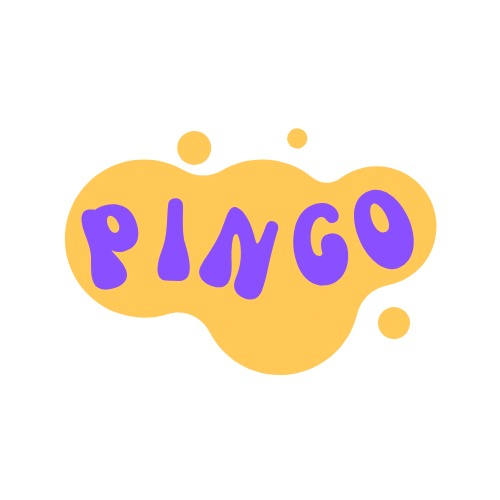

## Maintenance Note

Bump the version when edited — minor for tweaks (1.0.0 → 1.1.0), major for behavioural changes.

---

## Design System Integration

**Always read the full design system before generating any post:**
- Tokens (colors, type, spacing, shadows, radii): [`brand-guidelines/pingo/colors_and_type.css`](../../brand-guidelines/pingo/colors_and_type.css)
- General design rules: [`brand-guidelines/pingo/README.md`](../../brand-guidelines/pingo/README.md) (via the pingo-design skill)
- Logo assets: [`brand-guidelines/pingo/assets/`](../../brand-guidelines/pingo/assets/)

**What applies to Instagram posts:**
| Token group | Use for Instagram? |
|---|---|
| Color palette | ✅ Yes — backgrounds, text, accents |
| Typography (Poppins + Plus Jakarta Sans) | ✅ Yes |
| Spacing scale | ✅ Yes — for padding and gaps |
| Border radius (pill, blob) | ⚠️ Accent elements only (e.g. pill tag, circle underline) |
| Shadows / elevation | ❌ No — Instagram posts are flat |
| Blob shapes / floating dots | ❌ No — those are UI/web motifs; Instagram uses flat colour + type |
| Animation / easing | ❌ No — static format |

**Spacing tokens to use for Instagram layout (from CSS):**
- Canvas padding: `--space-9` (96px) — safe zone from all edges
- Gap between headline and body: `--space-7` (48px)
- Gap between body and logo: `--space-8` (64px)
- Accent mark from edge: `--space-9` (96px) to match text alignment

---

## Design Reference

The canonical reference for Pingo Instagram posts:

- **Background**: Flat solid colour — no gradients
- **Headline**: Very large, very bold (Poppins 800), fills most of the canvas width
- **Body copy**: Smaller, different colour from headline, relaxed line height
- **Accent mark**: A single decorative element (asterisk, circle, underline, dot cluster) in a contrasting brand colour — adds personality without clutter
- **Logo**: Pingo logo anchored bottom-left or bottom-right
- **Layout**: Clean and typographic — the words are the design. Minimal decoration.

**What makes it Pingo:** The boldness of the type, the warmth of the colour, and one small playful accent element. Not the blobs, not the dots — those are for web/UI contexts. Instagram posts are flatter and more direct.

---

## Canvas Spec

- **Size**: 1080 × 1350 px (4:5 portrait ratio) — always
- **Safe zone**: 90px padding on all sides
- **Logo area**: Bottom-left or bottom-right, within safe zone, ~110px wide
- **Format**: Self-contained HTML file saved to `content/drafts/` OR Canva design via `generate-design`

---

## Color Rotation System

Rotate through these four schemes across the week. Never use the same scheme on consecutive posts.

### Scheme A — Yellow Hero *(primary, use most often)*
| Element | Colour | CSS token |
|---|---|---|
| Background | `#ffc857` | `--color-yellow` |
| Headline | `#1a1a2e` | `--color-text-primary` |
| Body copy | `#2a5f74` (deep teal — not in system, specific to IG) | — |
| Accent mark | `#ff7a59` | `--color-coral` |
| Logo variant | Yellow-blob logo (`pingo-logo-yellow.jpg`) | — |

### Scheme B — Coral Hero
| Element | Colour | CSS token |
|---|---|---|
| Background | `#ff7a59` | `--color-coral` |
| Headline | `#ffffff` | `--color-white` |
| Body copy | `rgba(255,255,255,0.86)` | `--color-text-inverse` + opacity |
| Accent mark | `#ffc857` | `--color-yellow` |
| Logo variant | Coral logo (`pingo-logo-coral.png`) | — |

### Scheme C — Purple Hero
| Element | Colour | CSS token |
|---|---|---|
| Background | `#8a4fff` | `--color-purple` |
| Headline | `#ffffff` | `--color-white` |
| Body copy | `rgba(255,255,255,0.82)` | `--color-text-inverse` + opacity |
| Accent mark | `#ffc857` | `--color-yellow` |
| Logo variant | Text wordmark — Poppins 800 white + yellow `go` | — |

### Scheme D — Light/Neutral
| Element | Colour | CSS token |
|---|---|---|
| Background | `#f5f3ff` | `--color-bg` / `--color-purple-tint` |
| Headline | `#1a1a2e` | `--color-text-primary` |
| Body copy | `#5a5a7a` | `--color-text-secondary` |
| Accent mark | `#8a4fff` or `#ff7a59` | `--color-purple` / `--color-coral` |
| Logo variant | Yellow-blob logo (`pingo-logo-yellow.jpg`) | — |

---

## Accent Element Rotation

Each post gets **one** accent element. Rotate these:

| Accent | Description | Best with |
|---|---|---|
| **Asterisk `✳` or `*`** | Bold, oversized, top-left corner | Schemes A, B |
| **Circle underline** | Hand-drawn oval around a key word in the headline | Any scheme |
| **Thick underline bar** | Solid colour rectangle under key phrase | Schemes C, D |
| **Dot cluster** | 3–5 small circles grouped near the headline | Schemes B, C |
| **Corner bracket `[ ]`** | Thin bracket framing the headline area | Scheme D |
| **Pull quote mark `""`** | Large decorative opening quote, behind headline | Any scheme |

**Rule:** Never use more than one accent element per post. The accent is a detail, not a feature.

---

## Typography

| Role | Font | Weight | Size (at 1080px) |
|---|---|---|---|
| Headline | Poppins | 800 | 96–120px |
| Sub-headline / second line | Poppins | 700 | 80–96px |
| Body copy | Plus Jakarta Sans | 400 | 40–44px |
| Label / tag | Plus Jakarta Sans | 700 uppercase | 28–32px |

**Google Fonts import:**
```css
@import url('https://fonts.googleapis.com/css2?family=Poppins:wght@700;800&family=Plus+Jakarta+Sans:wght@400;500;600;700&display=swap');
```

**Typography rules:**
- Headlines use tight letter-spacing (`-0.025em`)
- Headline line height: `1.0–1.05` (very tight — Poppins 800 is designed for this)
- Body line height: `1.6–1.7`
- Sentence case everywhere — never ALL CAPS in body or headlines
- Max 8–10 words per headline line; let it wrap naturally to 2–3 lines

---

## Layout Patterns

### Pattern 1 — Top-heavy *(most common)*
```
[accent mark — top left]

[HEADLINE — very large, 2–3 lines]

[thin rule]

[body copy — 2–3 lines]


[logo — bottom left]
```

### Pattern 2 — Split
```
[HEADLINE LINE 1 — colour A]
[HEADLINE LINE 2 — colour B / accent colour]

[body copy]

[logo — bottom right]
```

### Pattern 3 — Statement-only *(for punchy single-idea posts)*
```
[SINGLE LARGE STATEMENT — 1–2 lines, fills canvas]

[tiny body copy or none]

[logo — bottom right]
[accent mark — bottom area]
```

---

## Content Rules

Every Pingo Instagram post must:
- Have **one clear idea** — not two
- Open with a headline that works standalone (readable as a thumbnail)
- Use **second person** ("you", "your") — never "our clients" or "small businesses"
- Feel **direct and warm** — like a knowledgeable friend, not a brand
- Body copy: 2–3 short sentences max on the graphic (full story lives in the caption)

**Never include on the graphic:**
- Website URLs (no website yet)
- "AI-assisted" disclosure (caption only)
- Hashtags
- Long sentences that require squinting
- More than two font sizes

---

## HTML Mockup Template

Use this base structure for all HTML mockups:

```html
<!DOCTYPE html>
<html lang="en">
<head>
  <meta charset="UTF-8">
  <title>Pingo — [Post title]</title>
  <!-- Design system tokens -->
  <link rel="stylesheet" href="../../brand-guidelines/pingo/colors_and_type.css">
  <style>
    * { margin: 0; padding: 0; box-sizing: border-box; }

    body {
      background: #1a1a2e; /* dark preview surround */
      display: flex; align-items: center; justify-content: center;
      min-height: 100vh; padding: 40px;
      font-family: var(--font-body);
    }

    /* 1080×1350 — 4:5 ratio, always */
    .post {
      width: 1080px; height: 1350px;
      position: relative; overflow: hidden;
      background: var(--color-yellow); /* swap per scheme */
      flex-shrink: 0;
    }

    /* Safe zone — all content stays inside */
    .content {
      position: absolute; inset: 0;
      padding: 96px; /* --space-9 */
      display: flex; flex-direction: column; justify-content: center;
    }

    /* Headline */
    .headline {
      font-family: var(--font-display);
      font-weight: var(--fw-extrabold); /* 800 */
      font-size: 108px; /* scaled up from --text-4xl for canvas size */
      line-height: var(--leading-tight);
      letter-spacing: var(--tracking-tight);
      color: var(--color-text-primary); /* swap per scheme */
      margin-bottom: 48px; /* --space-7 */
    }

    /* Body copy */
    .body {
      font-family: var(--font-body);
      font-weight: var(--fw-regular);
      font-size: 42px;
      line-height: var(--leading-relaxed);
      color: #2a5f74; /* deep teal for Scheme A; swap per scheme */
      max-width: 860px;
    }

    /* Accent mark (asterisk, etc.) */
    .accent {
      font-size: 72px;
      color: var(--color-coral); /* swap per scheme */
      line-height: 1;
      margin-bottom: 48px; /* --space-7 */
    }

    /* Logo — bottom corner */
    .logo {
      position: absolute;
      bottom: 96px; left: 96px; /* --space-9 */
      width: 110px; height: 110px;
      object-fit: contain;
    }
  </style>
</head>
<body>
  <div class="post">
    <div class="content">
      <div class="accent">✳</div>
      <div class="headline">Headline goes here.</div>
      <div class="body">Supporting body copy — 2–3 short sentences that expand on the headline.</div>
    </div>
    
  </div>
</body>
</html>
```

---

## Logo Assets

Stored at `brand-guidelines/pingo/assets/`:
- `pingo-logo-coral.png` — white cloud blob, purple "PINGO" type — use on coral or dark backgrounds
- `pingo-logo-yellow.jpg` — yellow cloud blob, purple "PINGO" type — use on yellow or light backgrounds

Embed as base64 for self-contained HTML files. Reference path for Canva uploads.

For dark/purple backgrounds where neither logo reads well, use a CSS text wordmark:
```css
.wordmark { font-family: 'Poppins', sans-serif; font-size: 32px; font-weight: 800; color: #fff; }
.wordmark em { color: #ffc857; font-style: normal; }
/* HTML: pin<em>go</em> */
```

---

## Canva Generation Query Template

When using `generate-design` with `design_type: instagram_post`, structure the query as:

```
Instagram post (1080x1350px, 4:5 portrait) for Pingo — an AI marketing company for small business owners.

Background: Flat solid [COLOUR] fill. No gradients.

Typography:
- Headline: "[TEXT]" — very large (Poppins or bold geometric sans), [COLOUR], ~110px, tight letter-spacing, left-aligned, 2–3 lines
- Body copy: "[TEXT]" — smaller, [COLOUR], ~26px, left-aligned, relaxed line height

Accent: [ACCENT ELEMENT DESCRIPTION] in [COLOUR], [POSITION]

Logo: Pingo logo (white cloud with purple text) bottom-left, ~110px wide.

Style: Clean, flat, typographic. The headline fills most of the canvas. Minimal decoration — the words are the design.
```

---

## Output Checklist

Before presenting a mockup, verify:
- [ ] Canvas is 1080 × 1350px
- [ ] Correct colour scheme applied (not the same as the previous post)
- [ ] One accent element only
- [ ] Headline is readable at thumbnail size
- [ ] Logo present, correctly positioned
- [ ] No URLs, hashtags, or disclosure text on the graphic
- [ ] Body copy is 2–3 sentences max
- [ ] File saved as `DRAFT_pingo_instagram-[slug]_[YYYY-MM-DD].html`

---

## Scheme Usage Log

Track which scheme was used last so the next post rotates correctly.

| Post | Date | Scheme |
|---|---|---|
| Day 1 — "You're not behind." | 2026-05-03 | A (Yellow Hero) |
| Day 2 — "Two camps. Both wrong about AI." (carousel) | 2026-05-04 | B (Coral Hero) |
| Day 3 — "The blank page is the enemy." (carousel) | 2026-05-04 | C (Purple Hero) |
| Day 4 — "5 things AI genuinely cannot do." (carousel) | 2026-05-05 | D (Light/Neutral) |
| Day 5 — "The output is only as good as the brief." (carousel) | 2026-05-06 | A (Yellow Hero) |
| Day 6 — "A full week of content. Done by Tuesday morning." (carousel) | 2026-05-07 | B (Coral Hero) |
| Day 7 — "Your AI marketing team. Built in a weekend." (single image) | 2026-05-08 | C (Purple Hero) |
| "The weekend rebuild" (6-slide carousel · follows Reel 9 CCC case study) | 2026-06-21 | A (Yellow Hero) |
